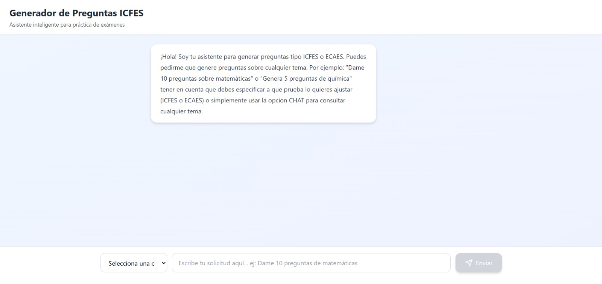
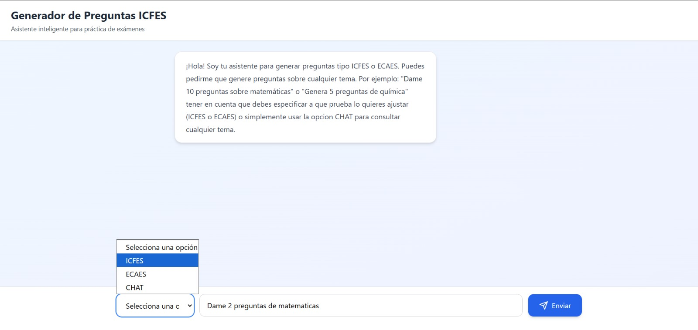
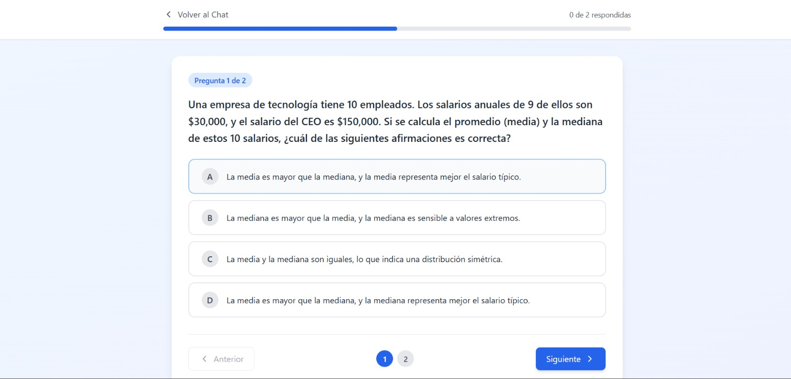
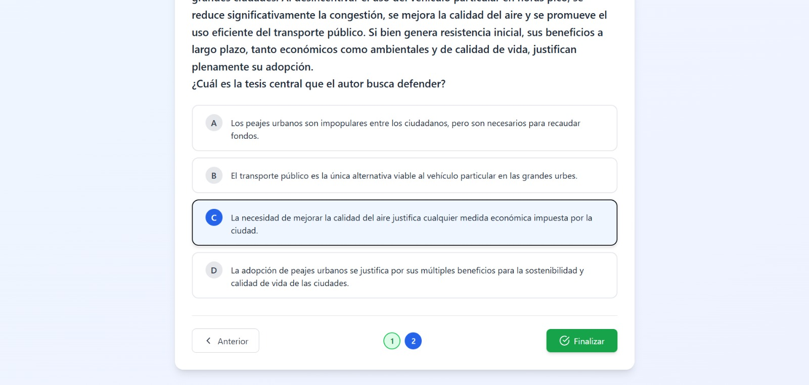
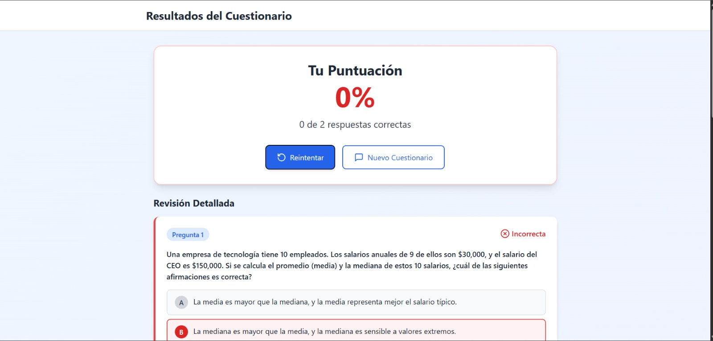
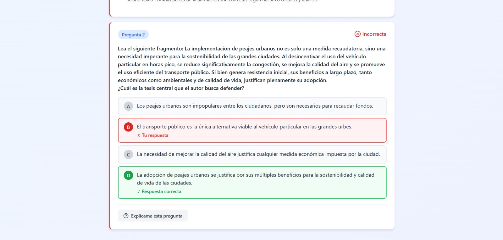
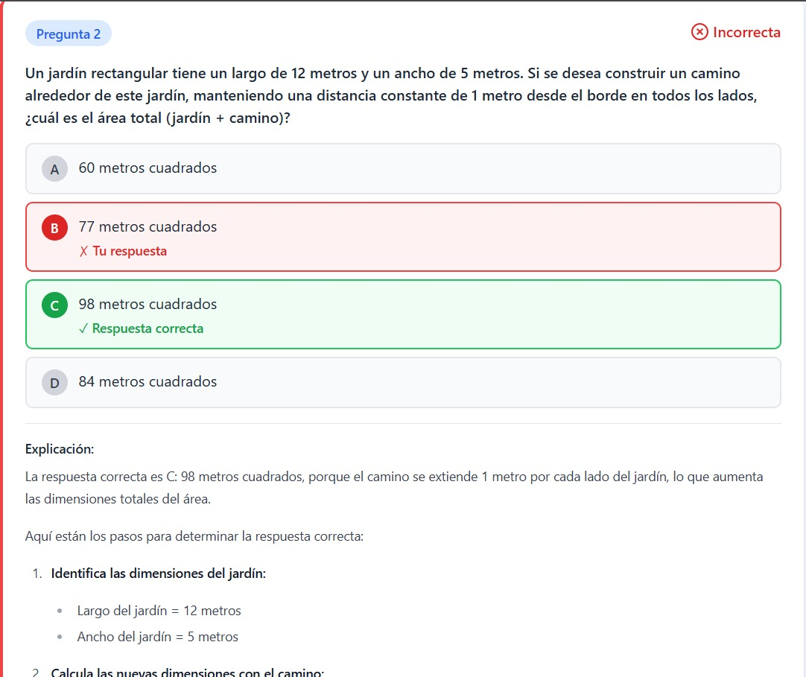
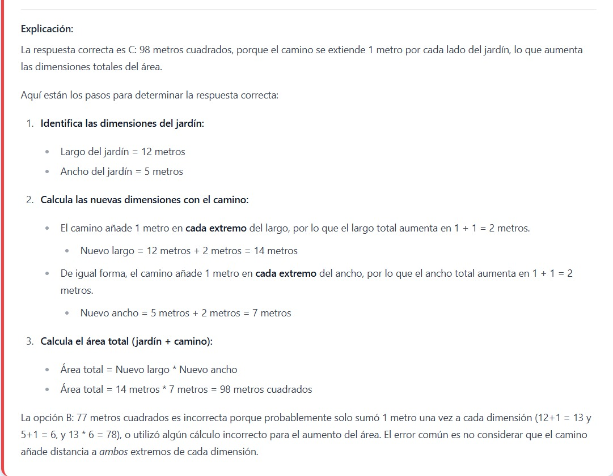
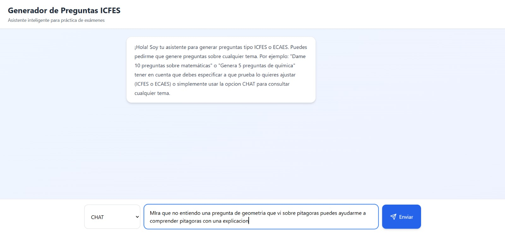
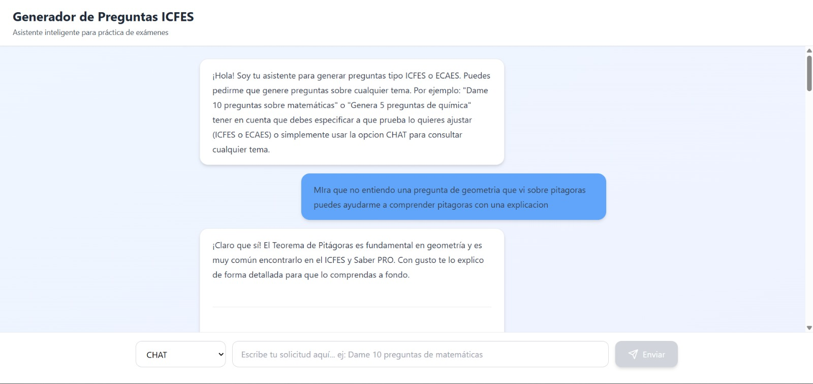

# 🎓 Sistema de Generación de Preguntas ICFES (Saber 11 & Saber Pro)

## 🔗 Enlaces Rápidos

[](https://generate-question-chat.netlify.app/)
[](https://github.com/HarrinsonToledo/Front-Generate-Questions)

---


## 🚀 Visión General del Proyecto

Este proyecto combina una **aplicación web de frontend** (construida con Next.js) y un **backend de automatización** (implementado con n8n y Google Gemini Chat) para ofrecer una herramienta de estudio dinámica y adaptativa.

El objetivo principal es **apoyar a estudiantes** que se preparan para las pruebas nacionales de Colombia, como **Saber 11** (educación media) y **Saber Pro** (educación superior), generando preguntas simuladas con la estructura y complejidad de las pruebas reales (ICFES).

Este proyecto fue realizado para la asignatura Redes de la Maestría En Ciencias De La Información Y Las Comunicaciones como Modalidad de Grado: Materias de Posgrado

### Características Principales:

  * **Generación Ilimitada:** Crea una cantidad ilimitada de preguntas sobre cualquier temática o área del conocimiento.
  * **Formato ICFES:** Preguntas estructuradas con un enunciado completo y cuatro opciones de respuesta, con una única respuesta correcta.
  * **Personalización:** Permite al usuario definir la **cantidad** y la **temática** específica para practicar.

-----

## 💻 Instalación y Configuración del Proyecto

El proyecto consta de dos componentes principales que deben ser configurados de forma independiente.

### 1\. Configuración del Frontend (Next.js)

Este componente es la interfaz de usuario donde los estudiantes interactúan con la herramienta.

**Repositorio:** `https://github.com/HarrinsonToledo/Front-Generate-Questions.git`

#### 1.1. Prerrequisitos

  * Node.js (versión LTS recomendada)
  * npm o yarn

#### 1.2. Pasos de Instalación

1.  **Clonar el repositorio:**

    ```bash
    git clone https://github.com/HarrinsonToledo/Front-Generate-Questions.git
    cd Front-Generate-Questions
    ```

2.  **Instalar dependencias:**

    ```bash
    npm install
    # o yarn install
    ```

3.  **Configurar Variables de Entorno:**
    Crea un archivo `.env.local` en la raíz del proyecto y define la URL de tu flujo n8n.

    ```
    # .env.local
    NEXT_PUBLIC_N8N_WEBHOOK_URL="https://www.digitalocean.com/community/tutorials/how-to-setup-n8n/webhook"
    ```

    **Asegúrate** de reemplazar `https://www.digitalocean.com/community/tutorials/how-to-setup-n8n` con la dirección donde está corriendo tu servidor n8n.

4.  **Ejecutar la aplicación:**

    ```bash
    npm run dev
    # o yarn dev
    ```

    La aplicación estará disponible en `http://localhost:3000` (o el puerto configurado).

### 2\. Configuración del Backend (n8n Flow)

Este componente maneja la lógica de negocio, la comunicación con la IA y la respuesta al frontend.

#### 2.1. Prerrequisitos

  * Instancia de **n8n** corriendo (nube o local).
  * Credenciales de API para **Google Gemini Chat Model** configuradas en n8n.

#### 2.2. Pasos de Instalación

1.  **Importar el Flujo:**
      * Abre tu interfaz de n8n.
      * Crea un nuevo flujo o importa el archivo `My workflow.json`.
2.  **Configurar Credenciales:**
      * Asegúrate de que los nodos **`Google Gemini Chat Model`** tengan las credenciales de tu API de Gemini Chat configuradas y activas.
3.  **Activar el Flujo:**
      * Cambia el estado del flujo de **"Inactivo"** a **"Activo"** para que el `Webhook` pueda comenzar a escuchar solicitudes.

-----

## 🔗 Integración y API del Flujo n8n

El frontend se comunica con el flujo de n8n mediante una solicitud HTTP simple.

### Detalles del Endpoint

El nodo **`Webhook`** está configurado para escuchar una solicitud `POST` en el path específico:

| Propiedad | Valor |
| :--- | :--- |
| **Método HTTP** | `POST` |
| **Path** | `icfes/preguntas` |
| **URL de Activación** | `https://www.youtube.com/watch?v=LLEBQjkjpOI/webhook/icfes/preguntas` |

### 📥 Estructura de la Solicitud (Request)

El frontend debe enviar un cuerpo **JSON** especificando lo que necesita:

```json
{
    "cantidad": 5,
    "tematica": "Movimiento Uniformemente Acelerado en Matemáticas"
}
```

### 📤 Estructura de la Respuesta (Response)

El flujo responde con un objeto que contiene un array de preguntas, siguiendo la interfaz **`ApiResponse`** del frontend:

```typescript
export interface ApiResponse {
  preguntas: Pregunta[];
}

export interface Pregunta {
  enunciado: string;
  respuestas: { A: string; B: string; C: string; D: string };
  respuestaCorrecta: string; // 'A', 'B', 'C', o 'D'
  imagen?: string;
}
```

-----

## ⚙️ Arquitectura del Flujo (My workflow.json)

El flujo está diseñado con un mecanismo de *agente inteligente* para garantizar la precisión en el formato de salida y el manejo de errores.

1.  **`Webhook`**: Recibe `cantidad` y `tematica` del frontend.
2.  **`AI Agent`**: Un agente inicial procesa la entrada, asegurando que se extraigan los parámetros correctamente.
3.  **`AI Agent1` (Generación Central)**:
      * Utiliza un **"System Message"** que le asigna el rol de **"Sistema de creacion de preguntas para los examenes nacionales ICFES"** para forzar la estructura y el tono correcto.
      * Usa una **expresión dinámica** para calcular las preguntas exactas que necesita generar (por si hubiera errores en pasos previos), garantizando que se cumpla con la `cantidad` solicitada.
      * El **Output Parser** obliga a la IA a devolver un JSON que mapea directamente a la interfaz `Pregunta[]` del frontend.
4.  **`Respond to Webhook`**: Devuelve el JSON final de las preguntas al frontend.

-----
## 👆🖱️ Instrucciones para el Usuario

Si prefieres omitir el proceso de instalación del repositorio y probar la aplicación de inmediato, puedes acceder directamente al enlace de la aplicación alojada:

[](https://generate-question-chat.netlify.app/)

### 1. Vista Principal y Opciones de Chat

La página principal es una interfaz de chat donde podrás interactuar y consultar lo que necesites, siguiendo la instrucción inicial.



A continuación, podrás seleccionar una de las opciones disponibles en el chat:

1.  **ICFES:** Genera un formulario con preguntas de simulación tipo Saber 11/Pro (ICFES).
2.  **ECAES:** Genera un formulario con preguntas de simulación tipo ECAES (Saber Pro específico).
3.  **CHAT:** Permite hacer consultas directas al agente de Inteligencia Artificial como un modelo de lenguaje normal.



### 2. Presentación y Solución del Formulario (ICFES/ECAES)

Si seleccionas la opción **ICFES** o **ECAES**, se mostrará un formulario con preguntas y sus respectivas opciones múltiples.

> **Límite:** La cantidad máxima de preguntas que se puede generar por formulario es de **20**. Esto se implementa para optimizar la respuesta de la IA y evitar redundancia o repetición en las preguntas.



Allí podrás seleccionar la opción que consideres correcta y avanzar. Es posible dejar una pregunta sin resolver y **devolverse** para responderla. Las preguntas que ya respondiste se marcarán en color verde.

Al responder la última pregunta, el botón de "Finalizar" estará disponible para terminar el formulario.



### 3. Visualización de Resultados y Retroalimentación

Una vez que hayas terminado y presionado **Finalizar**, el sistema te mostrará el resultado obtenido.



#### Detalle de Respuestas

Podrás revisar detalladamente las respuestas que tuviste correctas e incorrectas.

* **Incorrecta:** Cuando la respuesta fue errónea, se indicará claramente cuál era la opción correcta.



#### Opción de Explicación

Por último, puedes seleccionar la opción **"Explícame esta pregunta"** para obtener una retroalimentación detallada del agente de IA y comprender tu error o el fundamento de la respuesta correcta.




### 4. Modo CHAT

Si por el contrario seleccionaste la opción de **CHAT**, podrás interactuar con el modelo de IA para hacer consultas directas y generales.



En este modo, puedes seguir conversando por chat y el agente te responderá cualquier consulta de forma conversacional.


-----
## 🤝 Contribuciones

Si deseas mejorar la estructura de las preguntas, agregar nuevas funcionalidades (como almacenamiento de datos o feedback de las respuestas), o mejorar el diseño del frontend, no dudes en:

1.  Hacer un *fork* del repositorio.
2.  Crear una nueva rama (`git checkout -b feature/nueva-funcionalidad`).
3.  Realizar tus cambios y hacer un *commit* (`git commit -m 'feat: agrega X funcionalidad'`).
4.  Abrir un *Pull Request* (PR).

## 🤝 Autores

Diego Felipe Gamez Ramirez – 20201020009 

David Andrés Gómez Rincón – 20201020031 

Harrinson Toledo González - 20201020008 

Angela Maria Santos Hernández - 20202020145 
